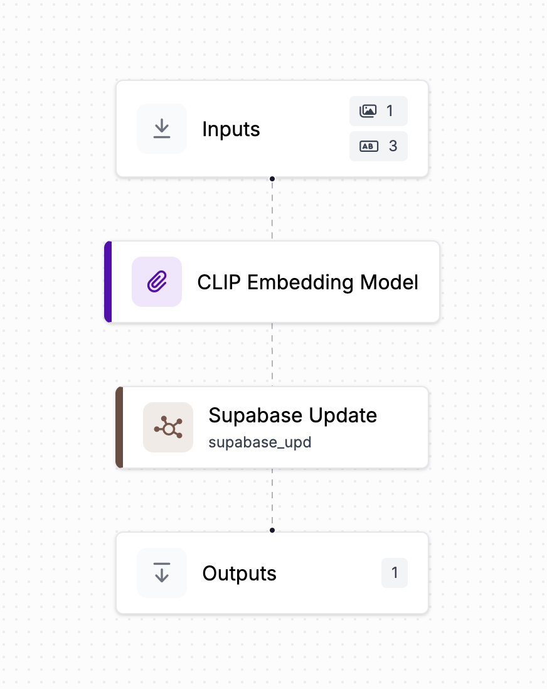

# NYCerebro

<!-- Display video -->
<video width="600" controls>
  <source src="attachments/demo.mp4" type="video/mp4">
  Your browser does not support the video tag.
</video>

This repository contains the code for the NYCerebro, project which won the Vercel + NVIDA World's Shortest Hackathon.

[Full writeup here](https://blog.roboflow.com/nycerebro/) of how we built this using CLIP, Supabase, Mapbox, and Roboflow.

## Project Description

When we learned that the city of New York has publicly shared its 900+ surveillance cameras video streams (https://webcams.nyctmc.org/map), we thought it would be a cool  to build a tool that would allow us to monitor the city in real-time. Specifically we got inspired by X-Men's Dr. Xavier's Cerebro device.

## How It Works

### Homepage (`/`)
- **Simple Search Interface:**  
  A clean, Google-style search page featuring the NYCerebro logo, a text box, and a “Search” button.
- **Query Suggestions:**  
  Quick links (e.g., “weird,” “busy,” “bright,” “time square,” “traffic”) help spark creative searches.

### Search Results (`/search?q=<QUERY>`)
- **Live Camera Preview:**  
  Your query is sent to a Roboflow CLIP workflow which generates an embedding from the text. This embedding is compared with camera embeddings stored in Supabase, and the best match is displayed as a live image (auto-refreshing every 2 seconds) using dynamically generated URLs.
  
- **Interactive Heatmap:**  
  A Mapbox-powered heatmap shows which parts of NYC most strongly correspond to your query. The location of the top-matching camera appears as the “hottest” point, while nearby matches contribute to the overall visual effect.

- **Backend Processing:**  
  While you wait, a loading screen is shown while the backend:
  - Calls a Roboflow workflow (using a dummy 10x10 black PNG as the required image input) to get a CLIP embedding.
  - Retrieves the 25 closest camera matches from Supabase (initially random until fully integrated).

### Roboflow & Supabase Integration
- **Roboflow Workflow:**  
  The app calls a Roboflow workflow that takes your query (with a dummy image) and returns a CLIP embedding.
- **Camera Image Processing:**  
  A Python script continuously fetches images from NYC cameras and uses Roboflow’s InferenceHTTPClient to process each image. The workflow then upserts the camera’s new CLIP embedding, ID, and current timestamp into our Supabase database.

### Workflow Diagram
Below is an image of the Roboflow Workflow that manages CLIP embedding generation and Supabase updates:

 

(You can find the code for the custom python block for supabase updates in the resources folder)

## Tech Stack & APIs
- **Frontend:** Minimalistic, search-driven interface.
- **Backend:** Python and Node.js handle image fetching, Roboflow integration, and database updates.
- **Database:** Supabase stores camera metadata and CLIP embeddings.
- **Maps:** Mapbox renders a real-time heatmap of NYC.
- **CLIP Embeddings:** Generated via a Roboflow Workflow integrating text queries and camera images.
